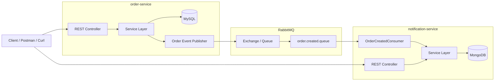

# Event-Driven Microservices with RabbitMQ

This repository demonstrates a simple **Event-Driven Architecture (EDA)** built using **Spring Boot microservices** communicating asynchronously through **RabbitMQ**.

The project simulates a basic e-commerce flow where creating an order in one service produces an event that is consumed by another service to generate a notification.

---

## Overview

The system consists of two microservices:

- **order-service**
  - exposes REST APIs for creating and retrieving orders
  - stores order data in **MySQL**
  - publishes an `OrderCreatedEvent` to RabbitMQ

- **notification-service**
  - consumes `OrderCreatedEvent` messages from RabbitMQ
  - stores notification data in **MongoDB**
  - exposes REST APIs for querying notifications

This setup demonstrates how services can stay **loosely coupled** by communicating through messaging instead of direct synchronous service-to-service calls.

---

## Architecture Diagram



---

## Event Flow

1. The client sends a request to **create an order**.
2. `order-service` saves the order in **MySQL**.
3. `order-service` publishes an `OrderCreatedEvent` to **RabbitMQ**.
4. `notification-service` consumes the event from `order.created.queue`.
5. `notification-service` stores a notification document in **MongoDB**.
6. The client can query notification data through the notification REST endpoints.

---

## Tech Stack

- Java 21
- Spring Boot 4
- Spring Data JPA
- Spring Data MongoDB
- RabbitMQ
- MySQL
- MongoDB
- Docker Compose
- JUnit 5
- Testcontainers
- MapStruct
- Lombok

---

## Architecture Concepts Demonstrated

- Event-Driven Architecture (EDA)
- Asynchronous communication between microservices
- Decoupled services using a message broker
- Polyglot persistence
  - MySQL for orders
  - MongoDB for notifications
- Dockerized local development environment
- Unit testing and integration testing
- Consumer-based event handling with RabbitMQ listeners

---

## Project Structure

```text
rabbitmq-manual-ack-sample/
├── docker-compose.yml
├── README.md
├── rabbitmq-manual-ack-sample.postman_collection.json
├── order-service/
└── notification-service/
```

---

## Running the Project

Make sure Docker Desktop is installed and running.

From the root folder of the project, run:

```bash
docker compose up -d --build
```

This will start:

- RabbitMQ
- MySQL
- MongoDB
- order-service
- notification-service

To stop the environment:

```bash
docker compose down
```

To stop and remove volumes:

```bash
docker compose down -v
```

---

## Service URLs

### order-service

Base URL:

```text
http://localhost:8070
```

### notification-service

Base URL:

```text
http://localhost:8071
```

### RabbitMQ Management UI

```text
http://localhost:15672
```

Default credentials:

```text
username: guest
password: guest
```

---

## API Endpoints

### Order Service Endpoints

Create Order

```http
POST /api/v1/orders
```

Get Order By Id

```http
GET /api/v1/orders/{id}
```

Get All Orders

```http
GET /api/v1/orders
```

### Notification Service Endpoints

Get All Notifications

```http
GET /api/v1/notifications
```

Get Notification By Id

```http
GET /api/v1/notifications/{id}
```

Get Notifications By Order Id

```http
GET /api/v1/notifications/order/{orderId}
```

Get Notifications By Customer Email

```http
GET /api/v1/notifications/customer?email=user@email.com
```

---

## Curl Samples

### order-service

#### Create Order

```bash
curl --location 'http://localhost:8070/api/v1/orders' \
--header 'Content-Type: application/json' \
--data-raw '{
  "customerId": "b7633a05-b06a-4f65-a5c0-d08705bf9625",
  "customerName": "Mohammad Hasan Abdel Gelil",
  "customerEmail": "mhabdelgelil@email.com",
  "orderDetails": [
    {
      "productId": "7a95b64d-1bd3-4af3-8b6b-629f715f9545",
      "productName": "Casio Watch",
      "productPrice": 55.5,
      "quantity": 1
    },
    {
      "productId": "b1b2060d-e6f9-46b3-91f7-51686233bae7",
      "productName": "Red Tie",
      "productPrice": 36.75,
      "quantity": 2
    }
  ]
}'
```

#### Get Order By Id

```bash
curl --location 'http://localhost:8070/api/v1/orders/13d9d954-3d7f-4d36-9682-862f944c6e5d'
```

#### Get All Orders

```bash
curl --location 'http://localhost:8070/api/v1/orders'
```

### notification-service

#### Get All Notifications

```bash
curl --location 'http://localhost:8071/api/v1/notifications'
```

#### Get Notification By Id

```bash
curl --location 'http://localhost:8071/api/v1/notifications/69b45bf8bec4fcae4c18c4eb'
```

#### Get Notifications By Order Id

```bash
curl --location 'http://localhost:8071/api/v1/notifications/order/cea94793-eb86-4631-a733-b90befc9868a'
```

#### Get Notifications By Customer Email

```bash
curl --location 'http://localhost:8071/api/v1/notifications/customer?email=mhabdelgelil%40email.com'
```

---

## Postman Collection

A ready-to-use Postman collection is included in the repository:

```text
EDA_Rabbit_MQ_Sample.postman_collection.json
```

You can import it directly into Postman and test the full flow.

---

## Testing

The project contains automated tests, including:

- unit tests for service layer logic
- unit tests for consumer delegation behavior
- integration tests for controller endpoints
- Testcontainers-based tests for database-backed integration scenarios

This helps validate the behavior in an environment closer to real infrastructure.

---

## Why This Project Matters

This project is a small but practical demonstration of backend engineering concepts commonly discussed in interviews and used in real systems:

- messaging between services
- eventual consistency
- asynchronous processing
- separation of concerns across services
- persistence strategy based on service responsibility

---

## Possible Future Improvements

Potential production-oriented enhancements:

- Dead Letter Queue (DLQ)
- retry and backoff strategies
- idempotent consumer handling
- message versioning
- distributed tracing
- centralized logging
- API Gateway
- Kubernetes deployment
- resilience patterns such as circuit breaker and rate limiting

---

## License

This project is intended for learning, demonstration, and portfolio purposes.
